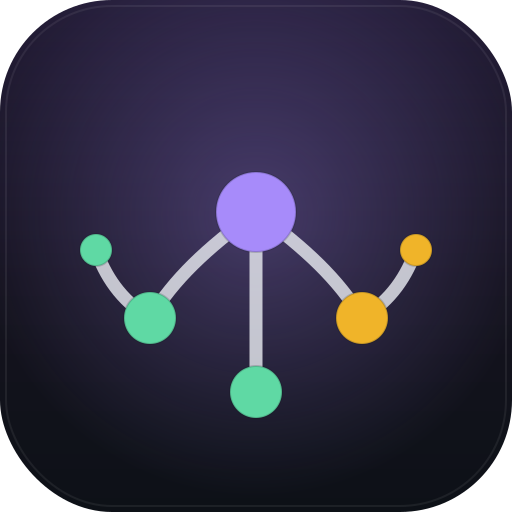
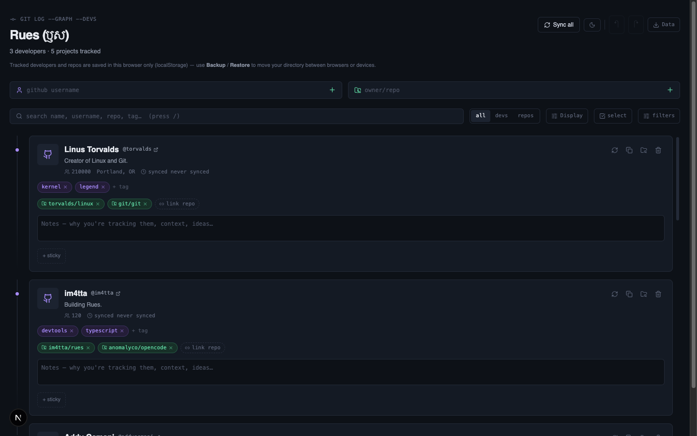

<picture>
  <source media="(prefers-color-scheme: dark)" srcset="./public/icons/icon.svg">
  
</picture>

# Rues (ឫស)

I was having a hard time keeping track of open-source developers I follow and the projects they maintain — bouncing between GitHub tabs, forgetting who works on what, losing context. So I asked Claude to build me a tool.

Rues (Khmer for "root") is what it made. It tracks developers and repos, links them together, and gives you a D3 graph to explore relationships. Everything lives in your browser's `localStorage` — nothing leaves your machine except GitHub API lookups.

 

## What it does

- **Add a dev** by GitHub username or a **repo** as `owner/repo` — fetched live from the GitHub API
- **Link** devs ↔ repos from either side so the connection shows everywhere
- **Three views**: list, responsive full-width grid (columns scale by device size), interactive D3 graph — plus an **Insights** view with Flint (Microsoft) charts (languages, top repos/devs, tags, sync recency, link density)
- **Graph tools**: zoom/pan, search, focus mode, selection box, PNG export (with legend + footer), reset zoom, pin nodes — **hover any node** to preview its details inline, and **click a developer node** to load their recent GitHub public activity feed into the sidebar
- **Filters**: language, tags, has notes — click any language chip to toggle
- **Bulk ops**: select multiple items → batch tag, link, export, or delete
- **Undo/redo** with 50 snapshots, `Ctrl+Z` / `Ctrl+Shift+Z`
- **Export options**: Obsidian (single `.md` with `[[wikilinks]]` + URLs or multi-file on Chrome/Edge 86+), plain **Markdown `.md`**, or JSON backup
- **Timestamps**: full date/time plus relative "x ago" for last sync and last commit
- **Sticky notes** with colors, auto-collapse with 3D flip animation
- **Markdown rendering** — tables, headings, wikilinks in the detail panel
- **Auto-save indicator** — green "saved" pill appears on every `localStorage` write
- **PWA**: installable, offline-capable, auto-updates to new builds; custom icon + maskable assets
- **Dark/light theme** (incl. Angkor & Mekong palettes), keyboard shortcuts, responsive layout

## Built with

Next.js, React, D3.js v7, Tailwind CSS, TypeScript.

## License

MIT
